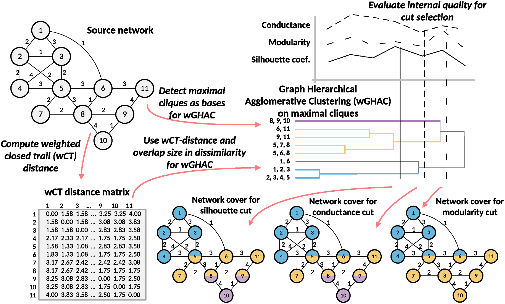

# weighted Graph Hierarchical Agglomerative Clustering (wGHAC)

In this repository the code for wGHAC community detection method is presented. This code is licensed under GNU GPLv3.

This repository contains supplementary material for the publication PROKOP, Petr; DRÁŽDILOVÁ, Pavla; PLATOŠ, Jan. Overlapping community detection in weighted networks via hierarchical clustering. PloS one, 2024, 19.10: e0312596. [https://doi.org/10.1371/journal.pone.0312596](https://doi.org/10.1371/journal.pone.0312596).
Overview of the proposed methodology for community detection in weighted networks is given in following figure.

In the file *comparative_analysis_description.txt* we have included the details on the specific configurations for reference methods.

In this study, we examined the trade connections among current OECD member states and trading partners, utilizing the Balanced Trade Value for Total Product as an indicator of bilateral trade relations. Trade network used in this study is included in the *data* directory. The full description for that dataset is included in the associated publication. The orignal source for data before processing is: OECD. Balanced merchandise trade statistics by CPA - OECD (Edition 2021).2022;doi:https://doi.org/https://doi.org/10.1787/3158e38e-en.

The main dependency of this method is on Closed Trail (CT) distance. The binary file is available in the closed_trail_distance_binary directory. The binary was build for Unix. For building of binary by yourself I am actually preparing the public repository (or you can access it on temporary address https://anonymous.4open.science/r/closed_trail_distance-F3E9/). You can contact me via an email (petr.prokop@vsb.cz) for other informations.

The wGHAC algorithm uses maximal cliques in a graph as base elements and uses proposed dissimilarities for agglomeration. Dissimilarity depends on the size of the overlap and on the CT distance between vertices.

The introduced extension of silhouette index is used to evaluate quality of community detection and select the best level in the hierarchy detected by wGHAC.

Short description of included source files:
- **cdlib_quality_measures_weighted.py** reimplement method for community quality evaluation in weighted networks
- **functions.py** contains functions and utilies primarily used for community quality evaluation
- **graph_hierarchical_agglomerative_clustering.py** holds object with algorithm for wGHAC calculation
- **run_ghac_community_detection.py** includes example for use of wGHAC on Zachary's karate club network